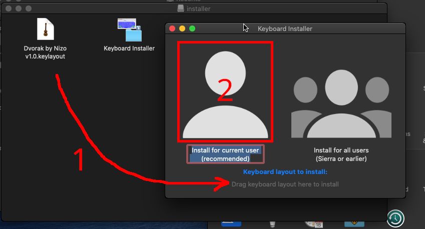

[Deutsche README hier](README.md)

# Dvorak by Nizo

German Dvorak done properly


<details>
<summary>AltGr + Fn Layer</summary>


</details>

# Why not Dvorak Type II?

* I learned the english version. Some characters are switched: `E-I`, `D-H`, `R-T`; `Z` and `L` are wrong
* `@` is in the AltGr Layer 4x - Why?
* `ß` is placed inconveniently (Shift).

# But what does this layout do better?

* Close to the english version - not much relearning necessary
* Special characters are easier to reach
* Optional Fn layer
* The possibility to copy, cut, and paste with one hand (not available on every platform)
* Bonus: `Å` for dialects.

# What tools/software did you use?

**Layout-Pictures:** [Keyboard Layout Editor](http://www.keyboard-layout-editor.com/)

**Linux:** Text Editor, reverse engineering, [An Unreliable Guide to XKB configuration](https://citeseerx.ist.psu.edu/viewdoc/summary?doi=10.1.1.600.7058), [my own Cheatsheet](https://github.com/thenizo/xkb-symbols-reference)

**Windows:** [MSKLC](https://www.microsoft.com/en-us/download/details.aspx?id=22339), [AutoHotKey](https://www.autohotkey.com/)

**macOS:** [Ukelele](https://software.sil.org/ukelele/)

# Installation

## Linux

The layout replaces Dvorak Type II, which shows up as "German (Dvorak)".

The Linux version does not get published via releases.

1. Run the following commands:
```
wget https://raw.githubusercontent.com/theNizo/DvorakByNizo-German/master/dbn-install.sh && chmod +x dbn-install.sh && ./dbn-install.sh && rm dbn-install.sh
```
2. (Optional) Move the backup. The script will warn you next time though.
3. Logout, login
4. Set layout (via GUI, oder run `setxkbmap de -variant  dvorak`, if you use X.org)
5. (If you use Fn in Gnome): Gnome Tweaks (`gnome-tweaks`) -> Keyboard & Mouse -> Additional Layout Options: 3. Layer - Caps; 5. Layer - AltGr

**Automatic stuff**

My script runs without asking, if it gets 3 arguments. These are called:

| | Fn Layer | key.Type | create backup |
|--- |--- |--- |--- |
| **Yes** | fn | type | bak |
| **No** | nofn | notype | nobak |

(The script doesn't test your internet connection and assumes that all files will/have download(ed) properly.)

## Windows

Not compatible with [this](https://github.com/kentonv/dvorak-qwerty), because of the AltGr layer.

### Installation

Download the newest version for Windows from [releases](https://github.com/theNizo/DvorakByNizo-German/releases), unzip and run `setup.exe`. Logout, login.

### Set layout

[Guide](https://www.windowscentral.com/how-change-your-keyboard-layout-windows-10)

### Set layout in Windows 10 AME

[AME](https://ameliorated.info/) doesn't have a GUI for that.

I will use the following ID as an example: `0c07:A0010c07` - Replace it with the ID listed in the release. (IDs can be figured out by [setting a default override](https://winaero.com/set-default-keyboard-layout-windows-10/) on an unmodified Windows 10, then running `Get-WinDefaultInputMethodOverride` in powershell.)

1. Powershell: `Set-WinDefaultInputMethodOverride -InputTip "0c07:A0010c07"`
1. Win+I -> Devices -> Typing -> Advanced Keyboard Settings -> Set default layout to "Dvorak by Nizo"

Sources:

* https://docs.microsoft.com/en-us/powershell/module/international/get-windefaultinputmethodoverride?view=win10-ps
* https://docs.microsoft.com/en-us/powershell/module/international/set-windefaultinputmethodoverride?view=win10-ps

### Use the layout on login screen

(Assuming you set DBN as default layout.)

Control Panel -> Region -> Administrative -> Copy Settings -> Tick "Welcome screen and system accounts" -> Ok

### Install Fn Layer

In both cases it's an AutoHotKey Script. The first Option doesn't need AutoHotKey installed.

**Option 1:** download the .exe

**Option 2:** Install [AutoHotKey](https://www.autohotkey.com/) and download the .ahk. If AHK can't recognize umlauts or `ß`, it's not formatted UTF-8-BOM (BOM is important) or UTF-16. You can change this with [Notepad++](https://notepad-plus-plus.org/), for example.

**Autostart:** Windows+R -> `shell:startup` - Move the file in the folder that just opened. The script will now start after login.

### Known Issues

`AltGr = Ctrl+Alt` - Because of that, some issues with shortcuts appear in some applications.

**Keepass:** Keepass usually has `Ctrl+Alt+A` and `Ctrl+Alt+Shift+A` as shortcuts, which blocks `(` and `{` as they are located on `A`. On my system I just removed the shortcuts. An alternative way is to use [KeepassXC](https://keepassxc.org/), a FOSS fork of Keepass.

**IDEs and stuff:** ...I guess. I can specifically tell about issues with shortcuts in IntelliJ, that I also just removed. I didn't use them anyway.

## macOS

### Installation

It is very straightforward, I'll explain anyway.

(testet in Catalina)

Download the newest version for macOS from [releases](https://github.com/theNizo/DvorakByNizo-German/releases).

Open the .dmg, start "Keyboard installer" from there. Pull the file to the text on the bottom, click on "User". (For all is apparently deprecated)

**!! WITH "USER", THE LAYOUT IS NOT AVAILABLE ON THE LOGIN SCREEN !!**



### Set layout

1. System Preferences -> Keyboard -> Input Sources -> `+`
1. The layout can be found in "others" (all the way down). You can also type "nizo" in the search bar.
1. Select layout, press "Add"
1. If the first checkbox in the Settings menu is ticked, the status bar has an icon for switching the layout. Select my layout here.

## QMK/Programmable Keyboards for Fn

Most mechanical keyboards are programmable with QMK and can implement the Fn layer this way. The keyboard can handle it way better.

I will go through the keys in order:

| Keycode       | Beschr.          |
|---------------|------------------|
| KC_WH_U       | scroll up        |
| KC_WH_D       | scroll down      |
| KC_INS        | Insert           |
| KC_HOME       | Home             |
| LCTL(KC_LEFT) | Ctrl+Left        |
| LCTL(KC_RGHT) | Ctrl+Right       |
| KC_END        | End              |
| KC_PAUS       | Pause            |
| KC_ESC        | Escape           |
| KC_MPRV       | Media Prev.      |
| KC_MPLY       | Media Play/Pause |
| KC_MNXT       | Media Next       |
| KC_BSPC       | Backspace        |
| KC_LEFT       | Left             |
| KC_DOWN       | Down             |
| KC_UP         | Up               |
| KC_RGHT       | Right            |
| KC_DEL        | Delete           |
| KC_SLCK       | Scroll-Lock      |
| LCTL(KC_B)    | Ctrl + X         |
| LCTL(KC_I)    | Ctrl + C         |
| LCTL(KC_DOT)  | Ctrl + V         |
| KC_ENT        | Enter            |
| KC_MUTE       | Mute             |
| KC_VOLD       | Vol. Down        |
| KC_VOLU       | Vol. Up          |
| KC_PGUP       | Page Up          |
| KC_PGDN       | Page Down        |
