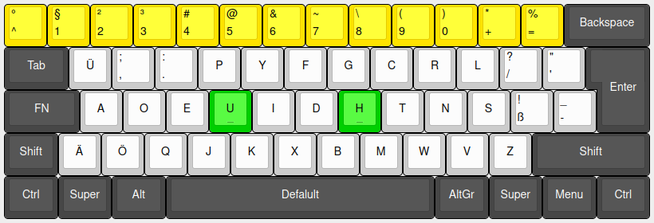
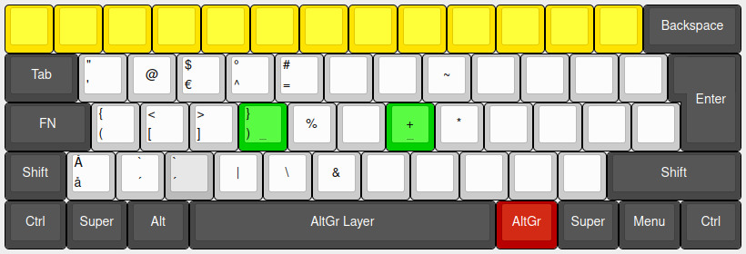
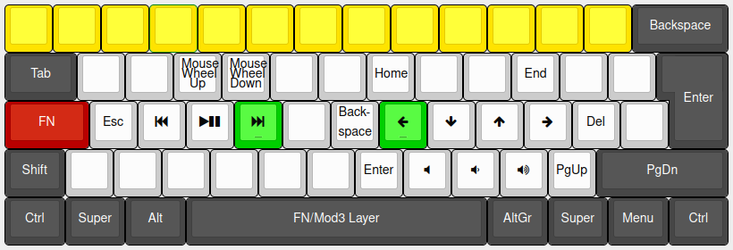
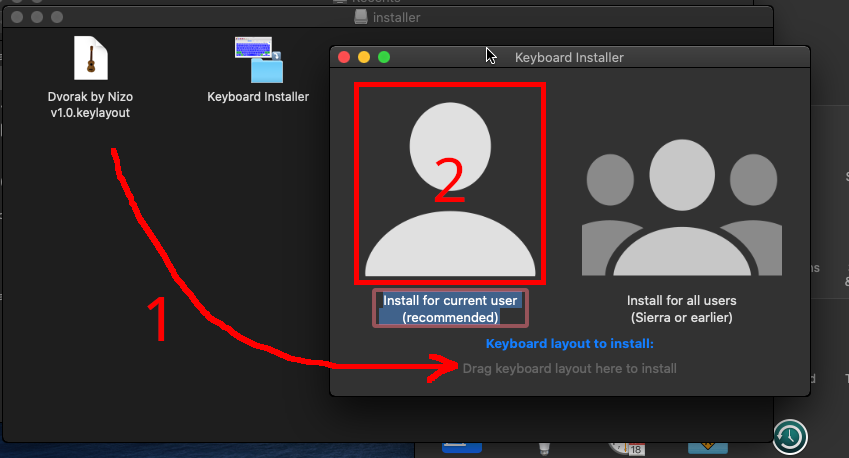

[english README here](README.english.md)

# Dvorak by Nizo

German Dvorak done properly



<details>
<summary>AltGr + Fn Layer</summary>




</details>

# Warum nicht Dvorak Type II?

* Ich habe die englische Version von Dvorak gelernt. Ein paar Buchstaben sind vertauscht: `E-I`, `D-H`, `R-T`; `Z` und `L` sind falsch.
* `@` ist 4x im AltGr Layer - Warum?
* `ß` ist unpraktisch platziert (Shift).

# Aber was macht dieses Layout besser?

* Nahe an der englischen Version - keine große Umstellung nötig
* viele Sonderzeichen einfach zu erreichen
* Optionaler Fn Layer

# Welche Tools/Software wurde(n) verwendet?

**Layout-Bilder:** http://keyboard-layout-editor.com/

**Linux:** Text Editor, Reverse Engineering, [An Unreliable Guide to XKB configuration](https://citeseerx.ist.psu.edu/viewdoc/summary?doi=10.1.1.600.7058), [eigenes Cheatsheet](https://github.com/thenizo/xkb-symbols-reference)

**Windows:** [MSKLC](https://www.microsoft.com/en-us/download/details.aspx?id=22339), [AutoHotKey](https://www.autohotkey.com/)

**macOS:** [Ukelele](https://software.sil.org/ukelele/)

# Installation

## Linux

Das Layout ersetzt Dvorak Type II, welches als "German (Dvorak)" genannt wird.

Die Linux Version wird nicht über Releases veröffentlicht.

1. Folgende Befehle ausführen:
```
wget https://raw.githubusercontent.com/theNizo/DvorakByNizo-German/master/dbn-install.sh && chmod +x dbn-install.sh && ./dbn-install.sh && rm dbn-install.sh
```
2. (Optional) Backup woanders hinlegen. Das Skript warnt aber auch nächstes Mal.
3. Aus- und wieder einloggen
4. Layout einstellen (per GUI, oder mit `setxkbmap de -variant  dvorak` unter X.org)
5. (Falls Fn unter Gnome): Gnome Tweaks (`gnome-tweaks`) -> Tastatur & Maus -> Zusätzliche Layout Optionen: 3. Layer - Caps; 5. Layer - AltGr

**Automatisierung**

Mein Skript läuft, ohne nachzufragen, durch, wenn es 3 Argumente bekommt. Diese lauten wie folgt:

| | Fn Layer | key.Type | Backup erstellen |
|--- |--- |--- |--- |
| **Ja** | fn | type | bak |
| **Nein** | nofn | notype | nobak |

(Das Skript überprüft nicht, ob eine Internetverbindung besteht und nimmt generell an, dass die Dateien erfolgreich heruntergeladen werden.)

## Windows

Aufgrund des AltGr Layers nicht [damit](https://github.com/kentonv/dvorak-qwerty) kompatibel.

### Installation

Unter [Releases](https://github.com/theNizo/DvorakByNizo-German/releases) die neueste version für Windows herunterladen, entpacken und `setup.exe` ausführen. Aus- und wieder einloggen.

### Layout einstellen

[Deutscher Guide](https://community.acer.com/de/kb/articles/70-windows-10-tastaturlayout-aendern), [englischer Guide](https://www.windowscentral.com/how-change-your-keyboard-layout-windows-10)

### Layout auf Windows 10 AME einstellen

[AME](https://ameliorated.info/) hat kein visuelles Menü.

Ich werde als Beispiel-ID folgende nehmen: `0c07:A0010c07` - Diese bitte durch die im Release angegebene ersetzen. (IDs können herausgefunden werden, indem man in einem unmodifizierten Windows 10 [ein Standard-Layout setzt](https://winaero.com/set-default-keyboard-layout-windows-10/) und dann den folgenden Befehl in die Powershell eingibt: `Get-WinDefaultInputMethodOverride`).

1. Powershell: `Set-WinDefaultInputMethodOverride -InputTip "0c07:A0010c07"`
1. (Nur auf Englisch probiert) Win+I -> Devices -> Typing -> Advanced Keyboard Settings -> Standard Layout auf "Dvorak by Nizo" setzen

* https://docs.microsoft.com/en-us/powershell/module/international/get-windefaultinputmethodoverride?view=win10-ps
* https://docs.microsoft.com/en-us/powershell/module/international/set-windefaultinputmethodoverride?view=win10-ps

### Layout bei Login verwenden

(Setzt vorraus, dass DBN als Standard-layout eingestellt ist)

Control Panel -> Region -> Administrative -> Copy Settings -> "Welcome screen and system accounts" auswählen -> Ok

### Fn Layer installieren

Es ist in beiden Fällen ein AutoHotKey Skript, der erste Weg benötigt keine Installation von AutoHotKey.

**Option 1:** .exe herunterladen

**Option 2:** [AutoHotKey](https://www.autohotkey.com/) installieren und .ahk Skript herunterladen. Wenn AHK die Umlaute nicht erkennt, ist die Datei nicht UTF-8-BOM (BOM ist wichtig) oder UTF-16 formattiert. In [Notepad++](https://notepad-plus-plus.org/) kann man das sehr gut ändern.

**Autostart:** Windows+R -> `shell:startup` - Datei in geöffneten Ordner verschieben. Damit wird das Skript nach Login ausgeführt.

## macOS

### Installation

Es ist sehr einfach, ich erklär's trotzdem.

(getestet unter Catalina.)

Unter [Releases](https://github.com/theNizo/DvorakByNizo-German/releases) die neueste version für macOS herunterladen.

Die .dmg öffnen, "Keyboard installer" von dort aus starten, Datei auf den Text unten ziehen, auf den User klicken. (Alle Benutzer wird scheinbar nicht mehr unterstützt.)

**!! BEI "USER" IST DAS LAYOUT NICHT AUF DEM ANMELDEBILDSCHIRM VERFÜGBAR !!**



### Layout einstellen

1. Systemeinstellungen -> Tastatur -> Eingabequellen -> `+`
1. Das Layout ist unter "andere" (ganz unten) zu finden. Alternativ kann man in der Suchleiste "nizo" eingeben.
1. Layout auswählen, "Hinzufügen"
1. Sofern der erste Haken im Einstellungsmenü angetickt ist, ist in der Statusleiste eine Auswahl für die Tastatur. Hier mein Layout auswählen.

## QMK/Programmierbare Tastaturen für Fn

Viele mechanische Tastaturen sind programmierbar und könne den Fn Layer so übernehmen. Die Tastatur selbst kann das wesentlich besser.

Ich gehe die Tasten der Reihe nach durch

| Keycode       | Beschr.          |
|---------------|------------------|
| KC_WH_U       | rauf scrollen    |
| KC_WH_D       | runter scrollen  |
| KC_INS        | Einfügen         |
| KC_HOME       | Pos1             |
| LCTL(KC_LEFT) | Strg+Links       |
| LCTL(KC_RGHT) | Strg+Rechts      |
| KC_END        | Ende             |
| KC_PAUS       | Pause            |
| KC_ESC        | Escape           |
| KC_MPRV       | Media Prev.      |
| KC_MPLY       | Media Play/Pause |
| KC_MNXT       | Media Next       |
| KC_BSPC       | Backspace        |
| KC_LEFT       | Links            |
| KC_DOWN       | Unten            |
| KC_UP         | Oben             |
| KC_RGHT       | Rechts           |
| KC_DEL        | Entfernen        |
| KC_SLCK       | Scroll-Lock      |
| KC_ENT        | Enter            |
| KC_MUTE       | Stumm schalten   |
| KC_VOLD       | leiser           |
| KC_VOLU       | lauter           |
| KC_PGUP       | Bild Rauf        |
| KC_PGDN       | Bild Runter      |
